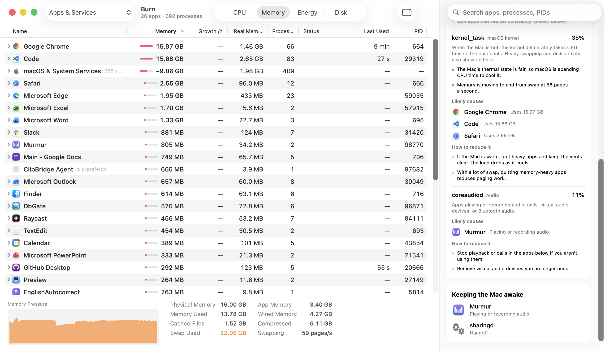

# Burn

**See what each app really costs your Mac — and what to do about it.**

Activity Monitor lists processes. A browser shows up as dozens of anonymous helpers, web
content processes are scattered across the list, and macOS's own services are a wall of
names like `kernel_task` and `WindowServer`. Burn groups everything under the app that owns
it, adds up what the app actually uses, and explains the numbers in plain English.



## What it does

**One row per app, with honest totals.** Every process is grouped under the app it belongs
to, using the same kernel accounting macOS uses for energy (resource coalitions). Totals
include helper processes that started and exited between samples, which a process list never
shows. On a busy Mac, per-app totals account for roughly 90% of all CPU use; summing the
visible processes accounts for about 60%.

Expand any app to see its processes, collapsed by kind — `Renderer ×14`, `Web Content ×3` —
and expand again for individual processes.

**Everything Activity Monitor shows.** CPU, CPU time, threads, idle wake-ups, GPU, memory,
real memory, Energy Impact (computed with the same weights macOS ships), disk read and write,
per-core load, memory pressure, swap, battery and thermal state, plus Quit, Force Quit,
Sample Process, Open Files and Reveal in Finder.

**Insights, not just numbers.**

- **Suggested to close** — apps you haven't used for hours that still hold memory or power,
  with a reason for each ("Hidden 3 h · 1.4 GB · 0.4 W") and how much quitting would free.
  Apps playing audio, running a build or keeping the Mac awake are never suggested.
- **Why macOS is busy** — when system services use real CPU, Burn says what each one does,
  what measurably explains its load (heat, swapping, disk activity, windows on screen, apps
  launching processes rapidly), which apps are the likely cause, and how to reduce it.
- **Memory pressure in plain English** — how much is swapped or compressed, who uses the
  most, and what closing the idle apps would free.
- **Busy while out of sight** — hidden or windowless apps that keep using CPU or waking the
  processor.
- **Runaway processes** — anything stuck near a full core for minutes, with a notification
  offering Quit or Force Quit.
- **Memory that keeps growing** — steady growth over 90+ minutes, the signature of a leak.
- **Battery used today** — each app's share of the day's battery drain, estimated from
  measured CPU energy, with the display and radios counted separately.
- **What changed** — apps that just jumped in CPU or memory, swap growing, process storms.
- **Keeping the Mac awake** — apps holding sleep assertions, including audio.

**History.** Per-app CPU, memory, Energy Impact and power for the last hour, 24 hours and
7 days, kept locally in a small SQLite database.

**Menu bar.** Power draw, CPU or memory pressure at a glance, with a popover listing the top
apps and a checklist of apps to quit in one click.

Burn never quits anything on its own. Quit sends the same request as ⌘Q, so apps still ask
about unsaved documents; Force Quit asks first and lists windows with unsaved changes.

## Requirements

- macOS 15 or later (developed on macOS 26, Apple silicon)
- Xcode command-line tools with Swift 6.2

## Building

```bash
git clone https://github.com/huangsikai8/Burn.git
cd Burn
IDENTITY="Your Code Signing Identity" ./build.sh
open build/Burn.app
```

Without `IDENTITY`, the app is signed ad hoc. That works, but macOS treats every rebuild as a
new app, so the optional Accessibility permission has to be granted again after each build.

## Permissions

- **Notifications** — for runaway-process, critical-memory and leak alerts. Optional.
- **Accessibility** — only to check for unsaved documents before a Force Quit. Optional.
- **Administrator password** — only when quitting a process owned by macOS or another user,
  the same as Activity Monitor.

Everything stays on the Mac. Burn makes no network connections.

## How the numbers are measured

- Apps are grouped by resource coalition, read with `proc_pidinfo`. Coalition totals come
  from the kernel's per-coalition usage counters and include members that have exited.
- CPU and energy for your own processes come from `proc_pid_rusage`. Power per app uses the
  kernel's CPU energy counter, which reflects whether work ran on efficiency or performance
  cores.
- Energy Impact is rebuilt from the weights in `/usr/share/pmenergy`, and matches `top`'s
  POWER column.
- macOS doesn't let an ordinary app read the memory of processes owned by root or other
  users. Burn reads resident size for those with `ps` every 30 seconds and the exact figure
  with `top` every five minutes; estimated values are shown with a leading `~`.

## Limitations

- No per-app network column yet. The only unprivileged source, `nettop`, costs more CPU than
  it would be worth running continuously.
- Grouping relies on kernel interfaces that are stable but not formally documented; a future
  macOS release could change them.
- Battery attribution covers CPU energy. GPU, display and radio power are reported together
  as "Display, radios & other".
- Likely causes for system-service load are measured correlations, not a kernel-level link
  between a service's work and the app that requested it.

## Debugging

Print one sample as text, including the grouped totals next to the raw process sums:

```bash
swift build
BURN_DUMP=1 BURN_DUMP_SECONDS=4 BURN_DUMP_PROCESSES=1 .build/debug/Burn
```

Set `BURN_STATE_DIR` to keep history in a different folder.
